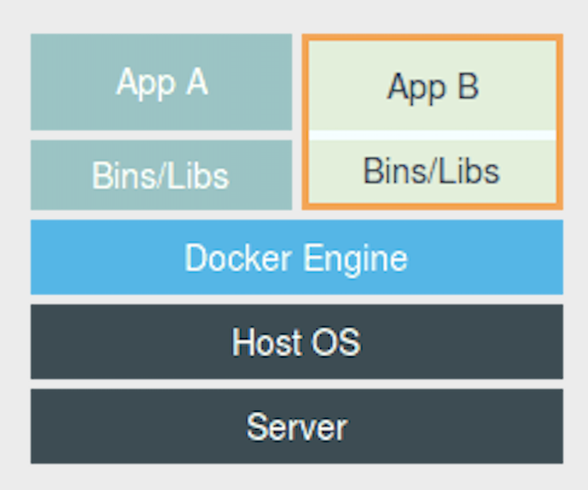
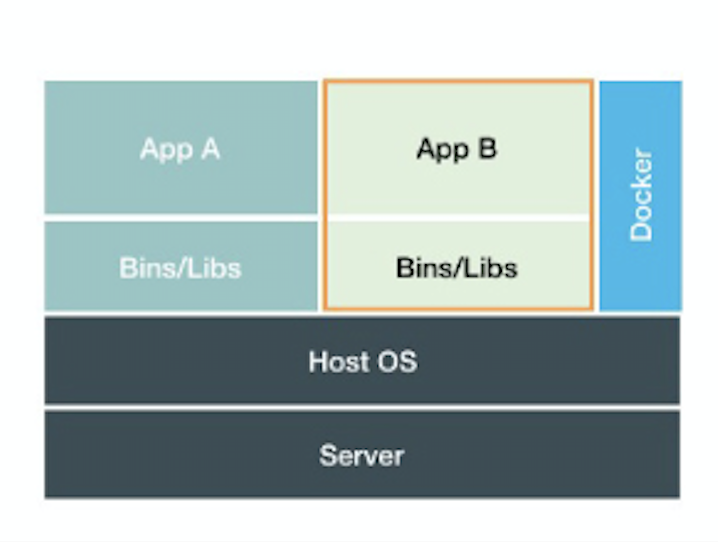
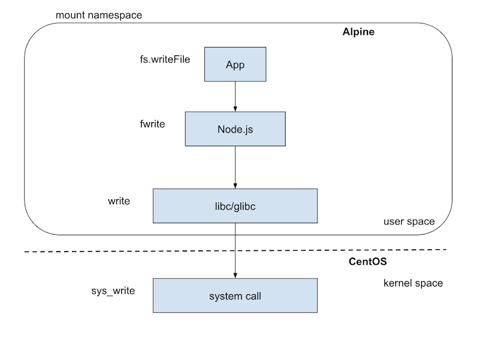

# Table of Contents

1.  [コミュニケーション力向上するためのアンケート](#org60b2fec)
2.  [背景](#org68ae7fa)
    1.  [Docker/Kubernetes](#org01bed11)
    2.  [Docker/Kubernetes のメリット](#orgd1764f5)
    3.  [Docker/Kubernetes のデメリット](#org6eb42c2)
3.  [目標](#org2e7e59f)
4.  [Docker](#orgc6c0cf9)
    1.  [Docker File System](#org26fbbd2)
    2.  [Docker Process](#org3aaec06)
5.  [Docker はただのプロセス](#orgd31e1a5)
    1.  [Docker は helper 的な存在(K8S も)](#orgc7c6fb9)
6.  [Docker なしで File System を隔離](#orgd391c51)
    1.  [OS と似たようなディレクトリを作成](#org9b9e88b)
    2.  [必要なライブラリをコピー](#orge1697b5)
    3.  [chroot (change root file system)](#orgf1944c2)
    4.  [chrootを実行](#org35018cc)
    5.  [Mount Namespace](#orga2462a9)
7.  [Mount Namespace API](#orgb915951)
8.  [Mount Namespace の注意点](#org44be048)
    1.  [nodejs の例](#org6b9cbe6)
    2.  [セキュリティの問題](#org42d213a)
9.  [Docker なしで Process を隔離](#orgf21ef0e)
    1.  [一般的な Process の作成](#org1277b3c)
    2.  [隔離された Process を作成](#org36164a4)
10. [Mini Docker](#orgdedef34)
11. [Namespace まとめ](#org5c4f2f1)
12. [Namespace の問題](#org6605040)
13. [cgroup (Linux Controll Group)](#orga7aa46c)
14. [cpu の制限](#org59c5b43)
    1.  [ファイルの確認](#orgf070d58)
    2.  [新しい cgroup の作成](#orgce79d04)
    3.  [動作確認用のプロセスを作成](#org6d118e0)
    4.  [cpu の制限](#org3f7e577)
    5.  [動作確認](#orgf6139f3)
15. [memory の制限](#org30765be)
    1.  [ファイルの確認](#org8c89a42)
    2.  [新しい cgroup の作成](#org3bbde91)
    3.  [memory の制限](#org826b423)
    4.  [制限超える時の挙動](#org91d149c)
16. [CGroup の注意点](#org1354637)
    1.  [メモリプールのを使う例](#orgb14d2a7)
    2.  [worker 数の設定の例](#orgc0ae4fc)
17. [まとめ](#org88bce72)

# コミュニケーション力向上するためのアンケート

-   わかり易さ (1~10)
-   発表前の Container の理解度 (1~10)
-   発表後の Container の理解度 (1~10)
-   自由コメント

# 背景

## Docker/Kubernetes

-   Docker/kubernetes が主流

Docker/K8S の知識が大変重要

## Docker/Kubernetes のメリット

-   どこの環境でも同じものが動く
-   デプロイ＆ロールバックが簡単
-   vm より軽量高効率
-   死活監視
-   障害時のセルフヒーリング
-   &#x2026;

## Docker/Kubernetes のデメリット

-   学習コストが高い
-   次々と新しいものが来る
    -   Helm, Kata container, Istio
-   正しく使わないと危ない
    -   さいやく事故が起こるかも

# 目標

-   Docker/Kubernetes の低レイヤーの理解度を高めること
-   チームで安全安心で Docker/K8S を使えるようになること

# Docker

よくある理解(誤解？)：アプリは Docker の上に動いている

## Docker File System

Docker 上で Host OS と異なる File System があるように見える

    ls /
    bin  boot  data  dev  etc  home  lib  lib64  media  mnt  opt  proc  root  run  sbin  srv  sys  tmp  usr  var
    
    docker run -it busybox /bin/sh
    ls /
    bin   dev   etc   home  proc  root  sys   tmp   usr   var

## Docker Process

Docker 上で Host OS と異なる Process System があるように見える

    ps
    PID TTY          TIME CMD
    28809 pts/0    00:00:00 bash
    30605 pts/0    00:00:00 ps
    
    docker run -it busybox /bin/sh
    ps
    PID   USER     TIME  COMMAND
    1 root      0:00 /bin/sh
    6 root      0:00 ps

# Docker はただのプロセス

アプリは Docker 上ではなく、Host OS 上で動いている

-   アプリは Linux の Namespace によって分離されている
-   リソースは Linux Cgroup によって制限されている

## Docker は helper 的な存在(K8S も)

# Docker なしで File System を隔離

## OS と似たようなディレクトリを作成

    export PATH=$PATH:/bin
    J=$HOME/example
    mkdir -p $J
    mkdir -p $J/{bin,lib,lib64,etc,var,proc,usr}
    mkdir -p $J/usr/share/terminfo/s
    sudo cp -vf /bin/{bash,ls,top,free,mount,tree} $J/bin
    tree $J

## 必要なライブラリをコピー

    # 実行ファイルと必要なライブラリを別のところからコピー
    list=`ldd /bin/ls | egrep -o '/lib.*\.[0-9]'`
    for i in $list; do sudo cp -vf $i $J/$i; done
    list=`ldd /bin/bash | egrep -o '/lib.*\.[0-9]'`
    for i in $list; do sudo cp $i -vf $J/$i; done
    list=`ldd /bin/top | egrep -o '/lib.*\.[0-9]'`
    for i in $list; do sudo cp $i -vf $J/$i; done
    list=`ldd /bin/mount | egrep -o '/lib.*\.[0-9]'`
    for i in $list; do sudo cp $i -vf $J/$i; done
    list=`ldd /bin/tree | egrep -o '/lib.*\.[0-9]'`
    for i in $list; do sudo cp $i -vf $J/$i; done
    list=`ldd /bin/free | egrep -o '/lib.*\.[0-9]'`
    for i in $list; do sudo cp $i -vf $J/$i; done
    cp /lib64/libgcrypt.so.11.8.2 $J/lib64/libgcrypt.so.11
    cp -rf /usr/share/terminfo/s $J/usr/share/terminfo/
    tree $J

## chroot (change root file system)

ルートディレクトリを変更する操作

## chrootを実行

    tree $J/
    # chroot を実行
    sudo chroot $J /bin/bash
    tree /
    # 存在しないコマンドを実行
    mkdir test

## Mount Namespace

Docker では Mount Namespace を使っている

-   chroot を更に改良したもの
-   Linux Namespace の一種

# Mount Namespace API

    clone(container_main, 
          container_stack+STACK_SIZE,
          CLONE_NEWNS | SIGCHLD, 
    mount("none", "/tmp/xx", "tmpfs", 0, NULL);

# Mount Namespace の注意点

-   Mount できるものは libc/glibc まで
-   OS のカーネルの機能を使うアプリは Mount できない

## nodejs の例

## セキュリティの問題

-   カーネル機能を利用するアプリ
    -   例：Container 内で settimeofday システムコールを実行すると、host os の時間が変わってしまう

# Docker なしで Process を隔離

## 一般的な Process の作成

    #define _GNU_SOURCE
    #include <sys/mount.h> 
    #include <sys/types.h>
    #include <sys/wait.h>
    #include <stdio.h>
    #include <stdlib.h>
    #include <sched.h>
    #include <signal.h>
    #include <unistd.h>
    
    #define STACK_SIZE (1024 * 1024)
    static char container_stack[STACK_SIZE];
    
    char* const container_args[] = { "/bin/bash", NULL };
    
    int container_main(void* arg) {
        printf("process id: [%5d] - inside child!\n",
               getpid());
        /* shell プロセスを起動する */
        execv(container_args[0], container_args);
        printf("Something's wrong!\n");
        return 1;
    }
    
    int main() {
        printf("Parent - start a process!\n");
        /* プロセス作成 */
        int pid = clone(container_main, 
                                  container_stack+STACK_SIZE,
                                  SIGCHLD, 
                                  NULL);
        /* プロセス終了のを待つ */
        waitpid(pid, NULL, 0);
        printf("Parent - process stopped!\n");
        return 0;
    }

## 隔離された Process を作成

PID Namespace

    clone(container_main, 
          container_stack+STACK_SIZE,
          CLONE_NEWPID | SIGCHLD, 
          NULL);

# Mini Docker

    cp a.out $J/
    # step 1: ファイルを隔離
    sudo chroot $J /bin/bash   
    # step 2: プロセスを隔離
    ./a.out

# Namespace まとめ

プロセスに対してリソースを分離するための機能

-   IPC Namespace
-   Mount Namespace
-   Network Namespace
-   PID Namespace
-   UTS Namespace
-   User Namespace

# Namespace の問題

リソース分離できるが、制限できない

-   CPU 1/5 まで制限したい
-   Memory 1GB まで制限したい
-   など

# cgroup (Linux Controll Group)

リソース制限

-   CPU
-   Memory
-   Hard disk
-   Network

# cpu の制限

## ファイルの確認

    ls /sys/fs/cgroup/
    # blkio  cpu  cpu,cpuacct  cpuacct  cpuset  devices  freezer ...
    
    cd /sys/fs/cgroup/cpu
    ls

## 新しい cgroup の作成

    sudo mkdir test
    ls test

## 動作確認用のプロセスを作成

    # 別 window で作成
    while : ; do : ; done &
    [1] 26860
    top
    # 1

## cpu の制限

例１：0.2 CPU を利用する

-   `cpu.cfs_period_us = 100000 us`
-   `cpu.cfs_quota_us = 20000 us`

100000 マイクロ秒内に 20000 マイクロ秒だけの CPU を利用

例2：2 CPU をフルに利用する

-   `cpu.cfs_period_us = 100000 us`
-   `cpu.cfs_quota_us = 200000 us`

100000 マイクロ秒内に 200000 マイクロ秒の CPU を利用

## 動作確認

    cat /sys/fs/cgroup/cpu/test/cpu.cfs_quota_us 
    -1
    cat /sys/fs/cgroup/cpu/test/cpu.cfs_period_us 
    100000
    
    sudo sh -c "echo 20000 > /sys/fs/cgroup/cpu/test/cpu.cfs_quota_us"
    sudo sh -c "echo pid > /sys/fs/cgroup/cpu/test/tasks"
    
    sudo sh -c "echo 40000 > /sys/fs/cgroup/cpu/test/cpu.cfs_quota_us"

# memory の制限

## ファイルの確認

    ls /sys/fs/cgroup/
    # memory ...
    
    cd /sys/fs/cgroup/memory
    ls

## 新しい cgroup の作成

    sudo mkdir test
    ls test

## memory の制限

`memory.limit_in_bytes`

    cat memory.limit_in_bytes
    # 9223372036854771712

## 制限超える時の挙動

`memory.oom_control`

    cat memory.oom_control
    # oom_kill_disable 0
    # under_oom 0 oom 状態かどうかを表示するだけ

-   `oom_kill_disable = 0`
    制限超えると kill される
-   `oom_kill_disable = 1`
    制限超えるとプロセスが sleep 状態になる

# CGroup の注意点

-   リソースが制限さるが、実際の情報が見える
    -   メモリ 2GB まで制限しても、 free コマンドで見ると、実メモリが表示される
    -   1CPU 制限しても、top コマンドで見ると、実 CPU 数が表示される

## メモリプールのを使う例

-   cgroup の設定
    -   実メモリ：10GB
    -   `memory.limit_in_bytes` ： 500MB
-   アプリ側の挙動
    -   実メモリを見て、メモリいっぱあるので、8GB 確保
    -   OOM 障害

## worker 数の設定の例

-   cgroup の設定
    -   実 CPU 48
    -   1 CPU で制限
-   アプリ側の挙動
    -   CPU 数を見て 48x2 のworker を起動
    -   有限の CPU 時間をお互いに奪ってしまう
    -   worker 数分のメモリも消費されてしまう

# まとめ

-   アプリは Docker/K8S 上ではなく、HOST OS 上で動いっている
-   アプリは Linux の Namespace 機能によって分離されている
-   アプリのリソースは Linux の Cgroup 機能によって制限されている

